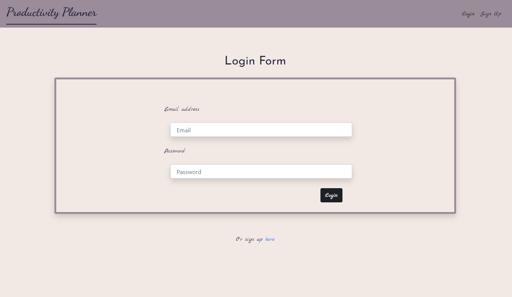
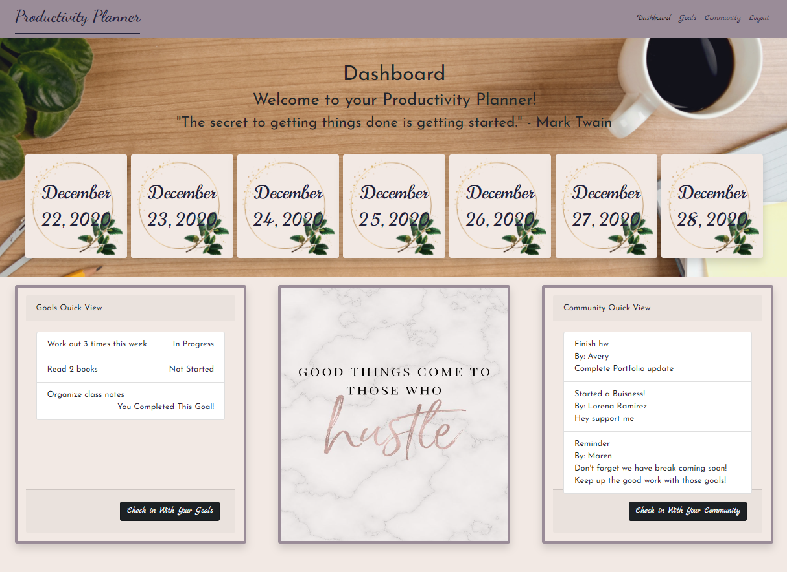
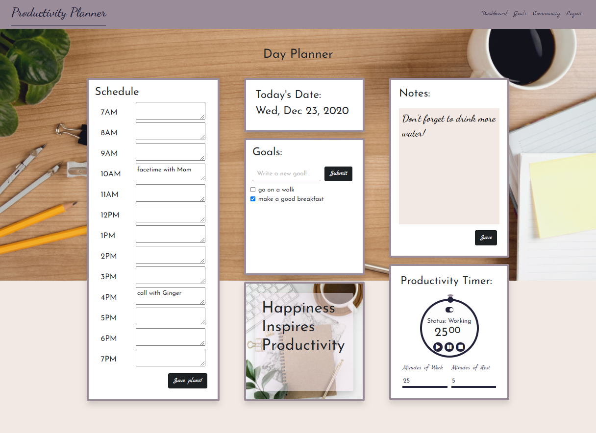
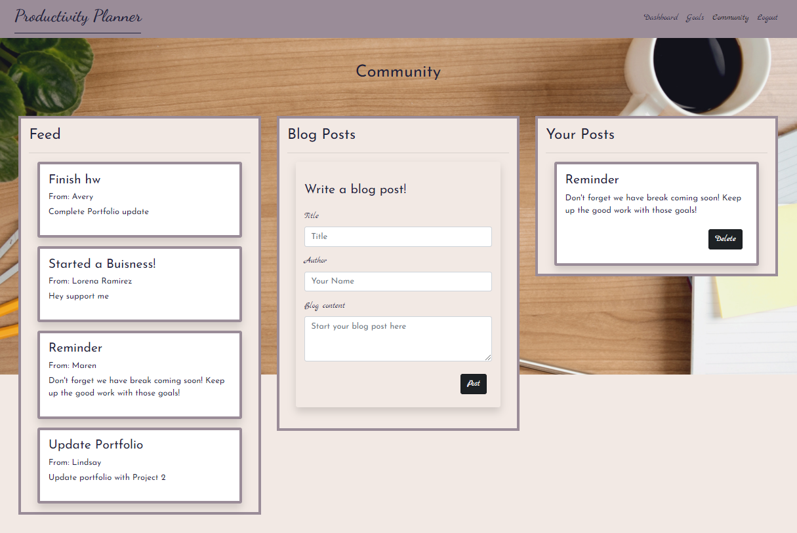

# Productivity Planner

## Table of Contents
* [Description](#description)
* [Usage](#usage)
* [Installation](#installation)
* [Screenshots](#screenshots)
* [Credits](#credits)
* [Links](#links)

## Description
The Productivity Planner provides users with the tools they need to plan and achieve their goals, while also providing an option to view and support others in accomplishing tasks. This planner prevents users from having to utilize multiple applications to plan out their days ahead. Now, all it takes is one application to put you on the path to success.

The Productivity Planner provides users with the option to list their goals, plan their days with an hourly and daily calendar, track their progress, take notes, and view and share their progress with other users in their community. 

## Usage
As a user:
I want to be able to set goals and track them via a calendar, so that I can keep track of my goals and progress

## Installation

## Screenshots
Below are screenshots of our deployed application. Click on any of them to be redirected to the application deployed on Heroku.

Login Page  

Dashboard Page  

Day Planner Page  

Weekly Goals Page  

Community Page  

## Credits
* UNCC Coding Bootcamp- We patterend our productivity timer off of a class activity, so that wasn't all our code! We were also given starter code for the Passport portions of the application with a login and signup page already working.

Contributors!
* Avery Brown-Gathings: https://github.com/averyjbrown2
* Lindsay Morris: https://github.com/lindsaymorris813
* Lorena Ramirez: https://github.com/Lorena-Ramirez
* Maren Hamby: https://github.com/marenhamby

## Links

Deployed link on Heroku: https://obscure-lake-47661.herokuapp.com/

Link to our code on GitHub: https://github.com/averyjbrown2/Project-2

